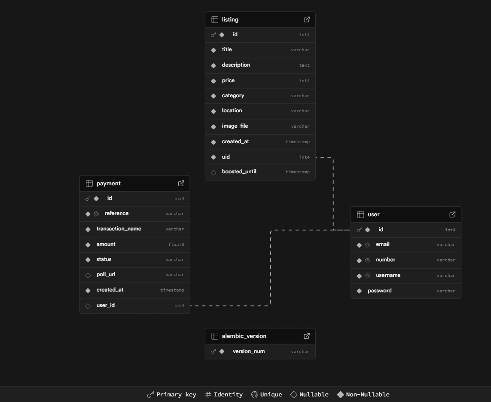
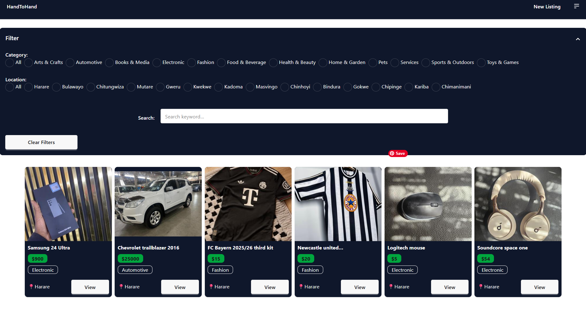
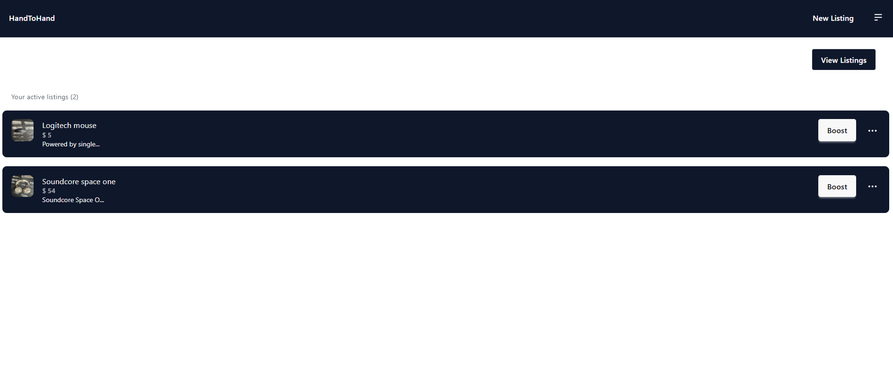
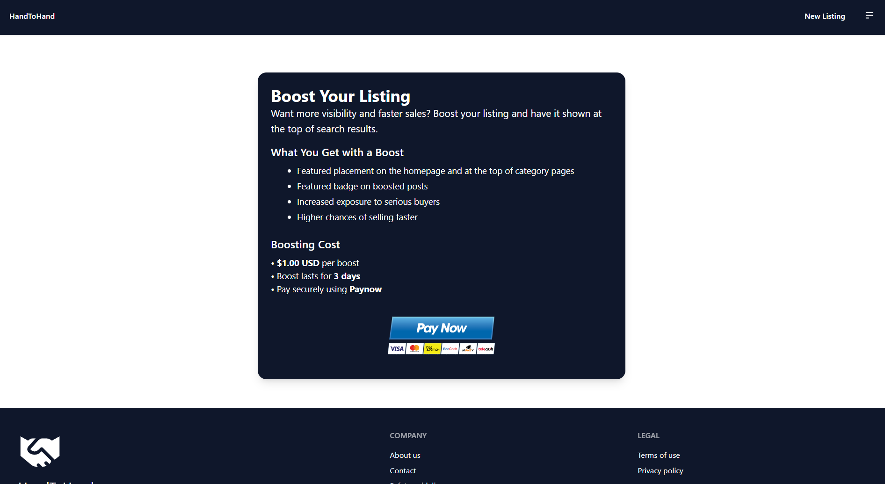

# HandToHand (H2H) Marketplace

**HandToHand** is a full-featured community marketplace platform built with Flask. It allows users to post listings, manage items, and connect with buyers directly via WhatsApp. The platform also features a premium "Boost" system integrated with Paynow payment gateway for featured listings.

## Features

- **User Authentication:** Secure signup, login, and password reset (via Flask-Mail).
- **Listing Management:** Users can create, update, and delete listings with image support.
- **Image Optimization:** Automatic image resizing and EXIF orientation correction using Pillow.
- **Cloud Storage:** Seamless integration with **Supabase Storage** for hosting listing images.
- **Dynamic Search:** Advanced filtering by category, location, and keyword search using SQLAlchemy.
- **HTMX Integration:** Partial page updates for a smoother dashboard experience.
- **WhatsApp Integration:** Automatic "Deep Link" generation to allow buyers to message sellers instantly.
- **Payment Gateway:** Integrated with **Paynow** for boosting listings (promoting them to the top of the feed).
- **Responsive Design:** Optimized for mobile and desktop usage.

---

## 🛡️ Safety & Privacy

The platform includes built-in routes for:

- **Privacy Policy** (`/privacy`)
- **Terms of Service** (`/terms`)
- **Safety Guidelines** (`/safety`) for secure peer-to-peer trading.

---

## Tech Stack

- **Backend:** Python / Flask
- **Database:** SQLAlchemy (PostgreSQL)
- **Storage:** Supabase
- **Payments:** Paynow (Zimbabwe)
- **Frontend:** HTML5, TailwindCSS(DaisyUI), Jinja2, HTMX
- **Tools:** Pillow (Image Processing), Flask-Bcrypt (Password Encryption)

---

## Database Schema

---

## Application Screenshots

---

## 🧠 What I Learned

Building **HandToHand** was a deep dive into the realities of full-stack engineering. Beyond just writing Python code, this project forced me to solve real-world architectural challenges:

### 1. HTMX

One of my biggest takeaways was learning that you don't always need a heavy JavaScript framework (like React or Vue) to create a snappy user experience.

- I learned how to use **HTMX** to swap HTML fragments over the wire.
- This taught me about **State Management** on the server side and how to design "partial" templates that can be injected into a live page without a full refresh.

### 2. Managing the Asynchronous Nature of Payments

- I had to implement **Webhook logic** to handle server-to-server notifications.
- I learned why **Polling** is necessary for UX (showing the user their payment status) but why **Webhooks** are the "source of truth" for database integrity.
- I gained experience handling **Race Conditions**—ensuring a listing is only boosted after the payment is fully verified.

### 3. Efficient Cloud Asset Management

- I learned to treat the web server as **Stateless**. Instead of saving files to the local folder, I mastered the stream-to-cloud workflow with **Supabase**.
- I learned **Defensive Programming** regarding file uploads: validating file types, handling upload failures gracefully, and ensuring orphaned files are deleted from the cloud when a user deletes their account.

### 4. Database Modeling & Relational Logic

I moved beyond basic CRUD operations to handle complex relationships in **SQLAlchemy**:

- **One-to-Many Relationships:** Mapping users to their various listings and payments.
- **Complex Ordering:** Using `case` logic to sort the feed dynamically based on a "Boosted" timestamp.
- **Data Integrity:** Using `db.session.rollback()` and try-except blocks to prevent database corruption during failed signups or updates.

### 5. DevOps & Deployment"

Deploying to **Render** with a custom `.site` domain taught me the "final 10%" of software development:

- **CI/CD:** Setting up an automated pipeline where GitHub commits trigger production builds.
- **DNS Management:** Configuring A-records and CNAMEs to point my domain to the Render servers.
- **Environment Security:** Managing sensitive API keys through environment variables so they never leak into public repositories.

---
